<h1 align="center">RTK Codex Plugin</h1>

<p align="center">
  <strong>Context-budget hygiene for shell-heavy agent sessions.</strong>
</p>

<p align="center">
  A small, auditable plugin that classifies shell requests before execution,
  optionally asks <code>rtk</code> for a rewrite, and compacts oversized
  model-visible output into local artifacts after execution.
</p>

<p align="center">
  <a href="https://github.com/mmmihaeel/rtk-codex-plugin/releases/latest">
    
  </a>
  <a href="https://github.com/mmmihaeel/rtk-codex-plugin/actions/workflows/ci.yml">
    
  </a>
  <a href="./LICENSE">
    
  </a>
  
  
</p>

<p align="center">
  <a href="./docs/install.md">Install</a>
  &middot;
  <a href="./docs/architecture.md">Architecture</a>
  &middot;
  <a href="./docs/configuration.md">Configuration</a>
  &middot;
  <a href="./docs/compatibility.md">Compatibility</a>
  &middot;
  <a href="./SECURITY.md">Security</a>
</p>

`rtk-codex-plugin` is designed for
[Codez](https://github.com/mmmihaeel/codez) and runtimes implementing the same
plugin manifest, hook payload, matcher, updated-input, and PostToolUse feedback
contracts. It works without an `rtk` executable for recognized output-guard
paths; command rewriting activates only when a compatible `rtk` is on `PATH`.

## At a glance

| Area                  | Current contract                               |
| --------------------- | ---------------------------------------------- |
| Release               | `v0.1.0`                                       |
| Runtime               | Python 3.11+ on a POSIX host                   |
| Verified environments | GitHub Actions Ubuntu; local Ubuntu on WSL2    |
| Native Windows        | Not supported in `v0.1.0`                      |
| Python dependencies   | Standard library only                          |
| Optional dependency   | `rtk` CLI implementing `rtk rewrite <command>` |
| State                 | Local artifacts and per-turn budget records    |
| License               | MIT                                            |

## What it does

| Stage                    | Component              | Responsibility                                                                                                             |
| ------------------------ | ---------------------- | -------------------------------------------------------------------------------------------------------------------------- |
| Before execution         | `rtk-codex-hook`       | Classify shell input, preserve deliberate pass-through cases, select the bounded guard, or request an optional RTK rewrite |
| During guarded execution | `rtk-output-guard`     | Limit recognized long-line inspection output while retaining the merged stream in a local artifact when truncation occurs  |
| After execution          | `rtk-output-post-hook` | Apply byte, line, and aggregate-turn budgets; emit compact model feedback with a local artifact reference when beneficial  |

Pass-through means the **command** is not rewritten before execution. Its
result can still be compacted by PostToolUse when it exceeds configured
budgets. Use the explicit bypass only when raw model-visible output is required.

## Architecture

```mermaid
flowchart LR
  accTitle: RTK Codex Plugin request and output flow
  accDescr: A shell request passes through a PreToolUse classifier. It is left unchanged, rewritten by an optional RTK command, or wrapped by a bounded output guard. After execution, a PostToolUse budget check either keeps the response or stores the received text locally and returns a compact summary.

  Request["Shell tool request"] --> Pre["PreToolUse classifier"]

  Pre -->|"Explicit bypass or pass-through"| Original["Original command"]
  Pre -->|"Eligible and rtk available"| RTK["rtk rewrite"]
  Pre -->|"Recognized risky inspection"| Guard["rtk-output-guard"]

  RTK --> Updated["Validated replacement"]
  Original --> Execute["Runtime executes command"]
  Updated --> Execute
  Guard --> Execute

  Execute --> Post["PostToolUse budget check"]
  Post -->|"Within budgets"| Response["Original tool response"]
  Post -->|"Budget exceeded and summary is smaller"| Artifact["Local artifact with best-effort restrictive permissions"]
  Artifact --> Summary["Compact summary, path, and SHA-256"]
```



The detailed sequence, failure behavior, state model, and trust boundaries are
in [Architecture](./docs/architecture.md).

## Decision policy

| Input shape                                                                                         | PreToolUse behavior                             | PostToolUse behavior                                              |
| --------------------------------------------------------------------------------------------------- | ----------------------------------------------- | ----------------------------------------------------------------- |
| Explicit `RTK_CODEX_BYPASS=1`                                                                       | No guard or rewrite                             | No compaction when the relevant command/stream bypass rules match |
| Tests, builds, Git, direct search, JSON/machine modes, Docker, interactive or live-control commands | Preserve the original command                   | Oversized output can still be compacted                           |
| Recognized line-limited inspection pipeline, risky-file limiter, or `codex debug prompt-input`      | Replace with the bounded guard                  | Guarded result remains eligible for normal budgeting              |
| Eligible simple command with compatible `rtk`                                                       | Accept only a bounded, control-free replacement | Result remains eligible for budgeting                             |
| Missing, timed-out, invalid, or unsafe RTK rewrite                                                  | Preserve the original command                   | Normal budgeting still applies                                    |

This classifier is a context guardrail, not a command-security system. It does
not sandbox commands, authorize actions, redact secrets, or replace runtime
approvals.

## Five-minute install

Run the installation inside Linux, macOS, or WSL2:

```bash
codex_home="${CODEX_HOME:-$HOME/.codex}"

git clone --branch v0.1.0 --depth 1 \
  https://github.com/mmmihaeel/rtk-codex-plugin.git \
  "$codex_home/plugins/cache/github/rtk-codex-plugin/local"

test -x \
  "$codex_home/plugins/cache/github/rtk-codex-plugin/local/hooks/rtk-codex-hook"
```

Enable plugin discovery and hook execution:

```toml
[features]
plugins = true
plugin_hooks = true

[plugins."rtk-codex-plugin@github"]
enabled = true
```

The exact plugin key depends on the runtime's installation source and cache
layout. See [Install](./docs/install.md) for release archives, verification,
updates, rollback, and uninstall.

## Default budgets

| Control                                |        Default |
| -------------------------------------- | -------------: |
| Human-facing output                    |          5 KiB |
| General visible output                 |         12 KiB |
| Aggregate visible output per turn      |         32 KiB |
| Visible lines                          |            300 |
| Summary head / tail                    |  4 KiB / 2 KiB |
| Pre-execution line body / visible body | 4 KiB / 64 KiB |
| Maximum accepted RTK rewrite           |         16 KiB |
| RTK rewrite timeout                    |      4 seconds |

Limits are measured in UTF-8 bytes and lines, not model tokens. Configuration
ranges and state paths are documented in
[Configuration](./docs/configuration.md).

## Model-visible compaction

When compaction is beneficial, the PostToolUse hook emits a summary shaped like:

```text
[rtk-output-guard: output compacted]
class: build-or-test-output
reason: medium-large human-facing output exceeded 5120 bytes
original_bytes: ...
artifact: ~/.local/state/rtk-codex-plugin/artifacts/...
sha256: ...
```

The artifact contains the complete text **received by PostToolUse**. The plugin
cannot recover content that a host runtime truncated earlier. SHA-256 identifies
the artifact contents; it does not encrypt or authenticate them.

## Verification

The repository contains a standard-library `unittest` suite covering rewrite
acceptance, pass-through classification, risky inspection guards, compaction,
aggregate budgets, stream handling, parallel-tool handling, and bypass rules.

```bash
python3 tests/test_rtk_codex_hook.py
```

Current evidence:

- 49 of 50 tests pass on Ubuntu/WSL2;
- one public-projection exporter check is intentionally skipped;
- GitHub Actions runs the suite on Ubuntu;
- no cross-repository, live Codez installation test is claimed.

## Boundaries

- Python 3.11+ and a POSIX environment are required for the complete plugin.
- Native Windows is unsupported; use WSL2 and clone inside the Linux
  environment.
- The optional RTK executable is trusted local code resolved from `PATH`.
- Guarded execution merges stderr into stdout before applying visible limits.
- PostToolUse budgeting is best-effort and depends on the host's hook contract.
- Artifacts may contain credentials, private source, or sensitive logs.
- Artifact and budget files persist until the operator removes them; no
  automatic retention or quota is included.

Read [Security](./SECURITY.md) before using the plugin with sensitive output.

## Ecosystem

RTK Codex Plugin is an optional edge component. Codez does not require it, and
the plugin does not require Teledex or Pitlane. See
[Stack fit](./docs/stack.md) for dependency direction and the conservative
multi-plugin ordering recommendation.

## Documentation

| Document                                     | Purpose                                                             |
| -------------------------------------------- | ------------------------------------------------------------------- |
| [Install](./docs/install.md)                 | Pinned installation, activation, verification, updates, and removal |
| [Architecture](./docs/architecture.md)       | Hook sequence, decision flow, state, and trust boundaries           |
| [Configuration](./docs/configuration.md)     | Environment variables, defaults, clamps, and storage paths          |
| [Compatibility](./docs/compatibility.md)     | Platform and runtime contract                                       |
| [Troubleshooting](./docs/troubleshooting.md) | Discovery, rewrite, artifact, and platform diagnostics              |
| [Stack fit](./docs/stack.md)                 | Optional ecosystem relationships                                    |
| [Security](./SECURITY.md)                    | Trusted-code model, sensitive artifacts, and reporting              |
| [Contributing](./CONTRIBUTING.md)            | Development and verification expectations                           |
| [Changelog](./CHANGELOG.md)                  | Release history                                                     |

## License

Released under the [MIT License](./LICENSE).

Copyright (c) 2026 Mykhailo Yarytskyi and contributors.
