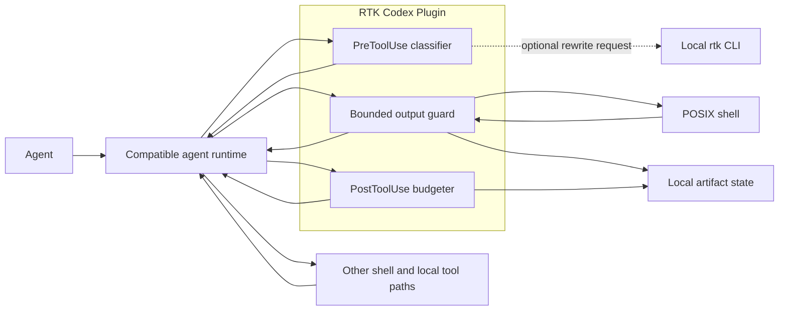
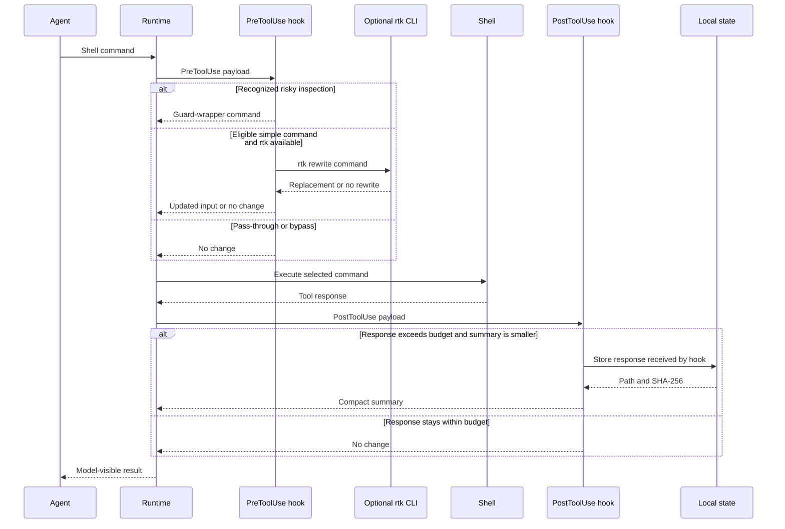
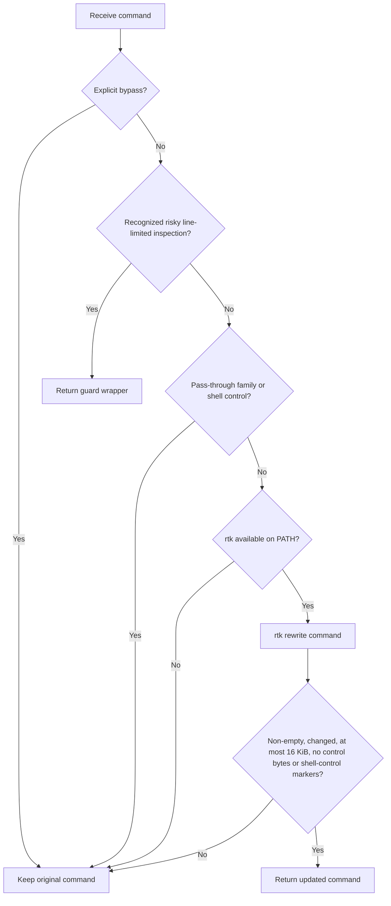
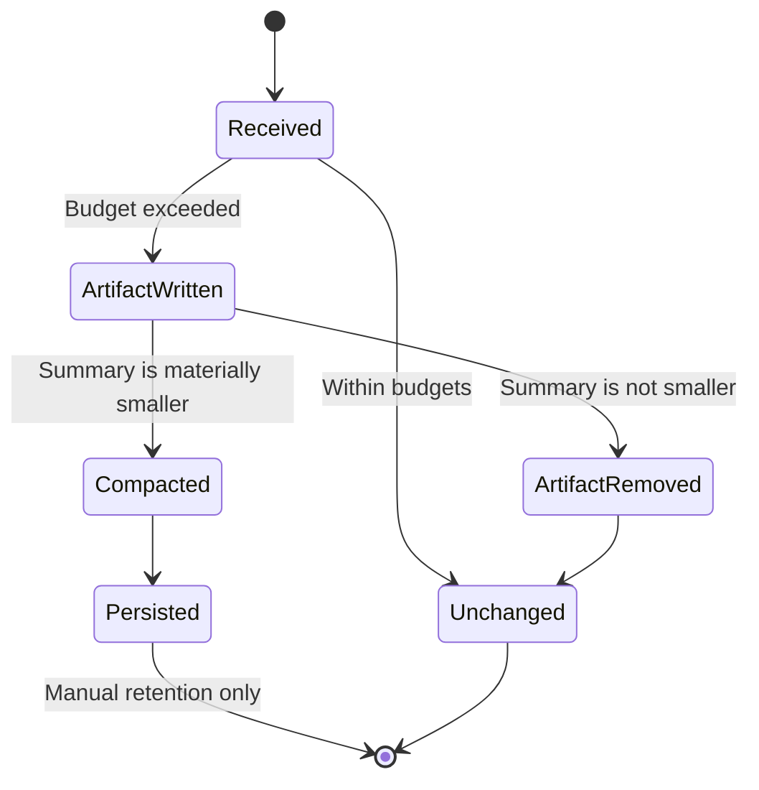

# Architecture

RTK Codex Plugin is a two-stage hook pipeline around a runtime-owned shell
execution. PreToolUse can replace the command input; PostToolUse can emit
compact model feedback with an artifact reference for oversized output. The
plugin does not execute the normal command itself unless it deliberately
selects the bounded pre-execution guard.

## System context

Approvals and sandboxing remain owned by the host runtime. The plugin is not a
policy engine.

## Request sequence

## Components

| Component                   | Input                  | Output                                                | Responsibility                                                                                 |
| --------------------------- | ---------------------- | ----------------------------------------------------- | ---------------------------------------------------------------------------------------------- |
| `.codex-plugin/plugin.json` | Plugin discovery       | Manifest metadata and paths                           | Points the runtime at hooks and the bundled skill                                              |
| `hooks/hooks.json`          | Runtime hook registry  | Matchers and commands                                 | Binds supported tool names to PreToolUse and PostToolUse                                       |
| `rtk-codex-hook`            | PreToolUse JSON        | No change or `updatedInput` JSON                      | Classifies commands, selects guard paths, and validates optional RTK rewrites                  |
| `rtk-output-guard`          | Base64-encoded command | Bounded merged output plus optional artifact metadata | Runs recognized risky inspection shapes and preserves the merged stream when truncation occurs |
| `rtk-output-post-hook`      | PostToolUse JSON       | No change or compact feedback                         | Applies byte/line/turn budgets and stores the response received by the hook                    |
| Artifact state              | Raw output text        | Local file and SHA-256                                | Preserves content omitted from the model-facing summary                                        |
| Budget state                | Session/turn counters  | JSON and lock files                                   | Tracks best-effort aggregate visible output                                                    |

## PreToolUse decision flow

The pre-hook accepts `tool_input.command` or `tool_input.cmd` for the manifest's
supported shell tool names.

The RTK subprocess receives the command as one argument, has a four-second
timeout, and may signal a usable result with exit code `0` or `3`. Missing,
timed-out, undecodable, oversized, or syntactically rejected results leave the
original command unchanged.

This is a syntactic guard, not proof that a returned command is semantically
safe.

## Bounded pre-execution guard

Recognized line-limited inspection pipelines, direct `head`/`tail`/`sed`
limiters over JSON, JSONL, NDJSON, or log files, and
`codex debug prompt-input` can be wrapped with a Python helper. The wrapper:

- decodes the selected command from Base64;
- executes it through the POSIX shell;
- merges stderr into stdout;
- shows at most 4 KiB of each line body by default;
- shows at most 64 KiB of response body by default;
- propagates the child process exit code;
- stores the complete merged stream only when truncation occurs.

Status notices and artifact metadata are emitted in addition to the nominal
64 KiB visible body, so that value is not a strict upper bound on every byte
written by the wrapper.

## PostToolUse budgeting

The post-hook evaluates the first matching condition:

1. known human-facing/stream/parallel output exceeds 5 KiB;
2. any string output exceeds 12 KiB;
3. output exceeds 300 lines;
4. adding the output would exceed the best-effort 32 KiB turn budget.

It then writes the received response to a local artifact and tries progressively
smaller head/tail summaries. Compact feedback is emitted only when the summary
saves at least 512 bytes or is no more than 90% of the received response.
Otherwise the new artifact is removed and the hook emits no change.

On successful compaction, the hook writes the summary to stderr and exits with
the hook feedback code `2`. A compatible runtime must interpret that contract
as compact model feedback and expose it appropriately to the model.

## State lifecycle

Artifacts, budget counters, lock files, and stream-bypass markers have no
automatic expiry. The aggregate turn budget is best-effort: its pre-check is
not locked, state failures leave output unchanged, and concurrent hooks can
race.

## Trust boundaries

| Boundary               | Consequence                                                         | Operator responsibility                                                |
| ---------------------- | ------------------------------------------------------------------- | ---------------------------------------------------------------------- |
| Runtime to plugin      | Hook code can observe and alter commands and output                 | Install only reviewed versions                                         |
| Plugin to `rtk`        | The first matching executable on `PATH` is trusted                  | Pin and verify the RTK distribution and `PATH`                         |
| Guard to shell         | Guarded commands run through `shell=True` with merged stderr/stdout | Do not treat the wrapper as a sandbox                                  |
| Runtime to PostToolUse | The plugin sees only the response supplied by the host              | Do not claim recovery of earlier host truncation                       |
| Plugin to local state  | Raw artifacts may contain sensitive content                         | Restrict paths, review permissions, and clean up manually              |
| Summary to model       | Artifact paths and hashes become model-visible                      | Do not expose paths that reveal sensitive host structure unnecessarily |

## Compatibility boundary

Full behavior requires a runtime that implements:

- `.codex-plugin/plugin.json` discovery;
- `${PLUGIN_ROOT}` expansion;
- hook matchers from `hooks/hooks.json`;
- PreToolUse `updatedInput` replacement;
- PostToolUse string feedback and exit-code-`2` handling;
- the listed shell, stream, and parallel tool identifiers.

Support in one Codex-derived runtime does not automatically prove compatibility
with every other runtime. See [Compatibility](./compatibility.md).
