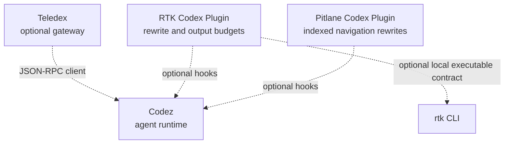

# Stack Fit

RTK Codex Plugin is an optional edge component in the Codez ecosystem. It owns
shell request classification and model-visible output budgeting; it does not
own the runtime, gateway, or indexed navigation service.

## Responsibilities

| Project                                                                   | Owns                                                                                     | Does not own                                                            |
| ------------------------------------------------------------------------- | ---------------------------------------------------------------------------------------- | ----------------------------------------------------------------------- |
| [Codez](https://github.com/mmmihaeel/codez)                               | Agent runtime, tool policy, App Server, plugin execution                                 | RTK-specific classification or gateway delivery                         |
| [RTK Codex Plugin](https://github.com/mmmihaeel/rtk-codex-plugin)         | Optional command rewrite adapter, bounded inspection wrapper, PostToolUse output budgets | Sandboxing, approvals, sessions, Telegram delivery, or RTK distribution |
| [Pitlane Codex Plugin](https://github.com/mmmihaeel/pitlane-codex-plugin) | Optional indexed source-navigation rewrites                                              | General output budgeting or runtime policy                              |
| [Teledex](https://github.com/mmmihaeel/teledex)                           | Telegram transport, session routing, queueing, and recovery                              | Runtime command policy or plugin implementation                         |

## Dependency direction

- RTK Codex Plugin requires only a compatible hook runtime and Python 3.11+ on
  POSIX.
- Codez does not require RTK.
- RTK does not require Pitlane or Teledex.
- Teledex may provision plugins for workers, but gateway operation remains
  outside this repository.
- The optional `rtk` executable is a separate local dependency resolved from
  `PATH`.

## Multi-plugin order

When both RTK and Pitlane are enabled, loading RTK before Pitlane is the
recommended integration order:

1. RTK handles its general command and output-budget responsibilities.
2. Pitlane may claim the narrow indexed-navigation forms it recognizes.

RTK classifier tests preserve documented Pitlane-owned navigation shapes, but
this repository does not contain a cross-plugin end-to-end test. Treat the
ordering as an integration recommendation, then verify it against the exact
plugin releases installed.

## Security boundary

Every enabled hook is trusted local code. Plugins can inspect or alter tool
input and output, but they do not replace Codez approvals, sandboxing, or host
access control. See [Security](../SECURITY.md).
